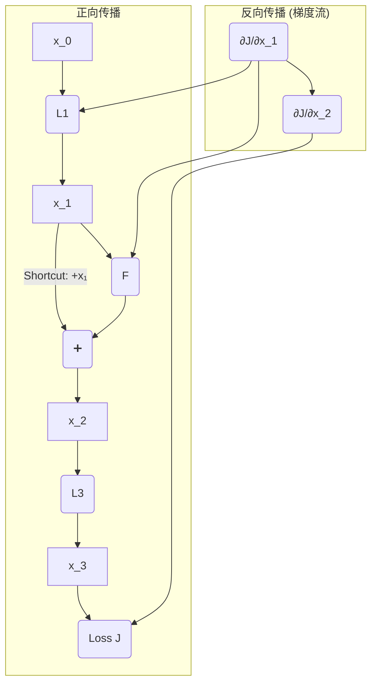

---
{"dg-publish":true,"permalink":"/notion/theoretical-knowledge/computer-science/artificial-intelligence/concept/res-net/"}
---

### 1. 背景：深度网络的“退化”问题 (The Degradation Problem)

**引言 (Introduction):**
在ResNet出现之前，深度学习领域的一个普遍认知是：网络越深，通过更多的层级，模型就能学习到越复杂、越抽象的特征，从而性能会越好。然而，实验发现，当网络深度增加到一定程度后，再继续加深网络，模型的性能反而会下降。这种现象被称为**“网络退化” (Degradation)**。

*   **注意**: 这不是**过拟合 (Overfitting)**。过拟合是指模型在训练集上表现好，但在测试集上表现差。而“退化”是指模型在**训练集和测试集上**的表现都变差了。
*   **理论与实践的矛盾**: 理论上，一个更深的模型至少应该能达到和一个浅层模型相同的性能。具体做法是：让新增加的层学习成为一个**恒等映射 (Identity Mapping)**，即直接把前一层的输出原封不动地传给下一层，这样深层模型就退化成了一个浅层模型。但实践中，让神经网络去拟合一个恒等映射都非常困难。

**ResNet的目标**：解决网络退化问题，使得构建真正有效的、非常深的网络成为可能。

### 1.1 核心前提：深度学习的底层逻辑 (The Underlying Logic of Deep Learning)

在深入探讨ResNet之前，我们必须首先澄清整个深度学习训练过程的基本逻辑。许多关于ResNet的困惑，都源于对这个基础逻辑的误解。

#### **问题一：我们训练出来的是一个函数，那我们到底在让哪个函数的梯度下降？**

**回答：我们梯度下降的目标，是让“损失函数 (Loss Function)”的值达到最低点，而不是我们训练的那个模型函数。**

整个逻辑链条如下：

1.  **模型函数 (Model Function)**: 这是我们想要训练出来的东西，它内部包含大量未知的**权重 (Weights)**。例如，一个简单的模型可以是 `y_pred = f(x; W)`，其中 `W` 是权重。它的**任务**是根据输入 `x` 做出预测 `y_pred`。

2.  **损失函数 (Loss Function)**: 这是一个**独立的“评价函数”**，用来衡量模型函数有多糟糕。它计算的是**“预测值”与“真实值”之间的差距**。例如，均方误差损失：`Loss = (y_pred - y_real)²`。

3.  **梯度下降 (Gradient Descent)**:
    *   我们的**目标**是找到一组最优的权重 `W`，使得**Loss函数的值最小**。
    *   **方法**就是对**Loss函数**求关于权重`W`的梯度（`∂Loss/∂W`）。这个梯度指明了让Loss增长最快的方向。
    *   我们沿着梯度的**反方向**去微调权重`W`，就能让Loss的值下降得最快。

**结论：通过最小化“损失函数”，我们间接地找到了最优的“模型函数”。** 我们是在Loss这个“山谷”里寻找谷底，而我们用来移动的工具，就是调整模型函数的权重。

#### **问题二：如果用同一组数据不断训练，梯度会怎样？**

**回答：会。Loss值和梯度（的绝对值）都会不断下降，直到梯度趋近于0，模型收敛。**

让我们想象一下用同一张图片不断训练的过程：

1.  **第1次迭代**: 网络权重是随机的。图片输入后，得到一个错误的预测，计算出一个**巨大的Loss**。反向传播根据这个巨大的Loss，产生一个**很大的梯度**，对权重进行一次**较大幅度**的更新。

2.  **第2次迭代**: 权重被更新过一次了。同一张图片再次输入，预测结果会比第一次好一点，计算出的**Loss变小了**。因此，产生的**梯度也变小了**，对权重的更新幅度也相应减小。

3.  **第N次迭代**: 这个过程不断重复。随着预测越来越准，Loss越来越小，梯度也越来越小。最终，当预测值无限接近真实值时，Loss趋近于0，梯度也趋近于0。此时，权重**不再更新**，对于这组数据来说，模型就已经**收敛**了。

在实际训练中，我们使用整个数据集（分成许多小批次, mini-batches）来重复这个过程，从而让模型学到适用于所有数据的通用规律，而不是只记住某一张图片。

---

### 2. 核心思想：残差学习 (Residual Learning)

ResNet的作者们提出了一个天才般的想法：**与其让网络层直接学习一个理想的底层映射 `H(x)`，不如让它学习这个映射与输入 `x` 之间的“差值”，即残差 (Residual)。**

#### 2.1 残差块 (Residual Block) 的结构

为了实现残差学习，ResNet设计了**残差块 (Residual Block)**。

*   **主路 (Main Path)**: 输入 `x` 经过一系列的卷积层和激活函数，得到一个特征变换结果。我们称这个结果为 `F(x)`。
*   **快捷连接 (Shortcut Connection / Skip Connection)**: 输入 `x` 同时通过一条“捷径”，不经过任何处理（或只经过一个简单的线性变换以匹配维度），直接到达主路的末端。
*   **汇合点**: 在末端，主路的输出 `F(x)` 与快捷连接的输出 `x` 进行**逐元素相加**。这个块的最终输出被定义为 `H(x) = F(x) + x`。

#### 2.2 为什么学习残差更容易？

假设在某种情况下，最优的映射就是一个恒等映射，即 `H(x) = x`。

*   **对于传统网络**: 它需要费力地调整卷积层中的所有权重，去拟合一个 `H(x) = x` 的函数。
*   **对于残差网络**: 由于最终输出是 `H(x) = F(x) + x`，它只需要让 `F(x) = 0` 即可。让一个网络的权重趋向于0（从而输出为0），远比让它拟合一个恒等函数要容易得多。

**核心优势**：ResNet通过这种结构，为网络提供了一条“什么都不做”的捷径。如果增加的层是有益的，网络就会通过主路学习到有用的特征 `F(x)`；如果增加的层是无益的，网络就可以轻易地让 `F(x)` 趋近于0，从而退化为恒等映射，至少保证性能不会下降。

---

### 3. 深入解答：关于“加上x”的核心疑惑

这里我们来详细剖析“为什么加上x”以及整个学习流程，解决之前的疑惑。

#### 3.1 疑惑一：为什么最后要“画蛇添足”地加上`x`？

**回答：`+x` 不是在学习任务完成后的“画蛇添足”，而是整个学习任务的“前提和定义”。**

让我们对比一下设计者的思路：

*   **传统CNN设计者的思路**：
    1.  我需要一个网络块来学习目标 `H(x)`。
    2.  我把这个网络块的**输出定义为 `H(x)`**。
    3.  所以，这个网络块的**任务就是直接学习 `H(x)`**。

*   **ResNet设计者的思路**：
    1.  我需要一个网络块来学习目标 `H(x)`。
    2.  我把这个网络块的**输出重新定义为 `F(x) + x`**，其中 `F(x)` 是卷积层的输出。
    3.  所以，这个网络块里的卷积层的**任务就变成了学习残差 `F(x) = H(x) - x`**。

**关键洞察**：**`+x` 这个操作是整个残差块结构定义的一部分，它先于学习过程。正是因为结构上规定了最后必须 `+x`，才使得中间卷积层的学习目标从困难的 `H(x)` 变成了简单的 `F(x)`。** 它不是一个后处理步骤，而是设计的基石。

#### 3.2 疑惑二：学习流程到底是怎样的？是先学再减再加吗？

**回答：不是。实际流程由网络结构决定，学习过程（反向传播）会自动适应这个结构。**

让我们想象一下**一个神经元（或一层权重）在训练时会“思考”什么：**

1.  **前向传播 - 我做了什么？**
    *   “我（权重W）接收了输入`x`，经过计算输出了`F(x)`。在我的下游，有人把我的输出`F(x)`和原始的`x`加了起来，得到了`H(x)`。”

2.  **反向传播 - 我收到了什么指令？**
    *   “网络的最终端传来一个误差信号（梯度），这个信号告诉我，`H(x)` 需要进行一些调整才能减小总误差。”
    *   “因为 `H(x) = F(x) + x`，这个调整指令会同时传递给我产生的 `F(x)` 和原始的 `x`。”
    *   “我（权重W）收到的指令是：‘请调整你自己，让你产生的 `F(x)` 发生改变，从而让 `F(x)+x` 更接近期望的目标。’”

3.  **学习与适应 - 我该怎么做？**
    *   “我的任务不是凭空创造出一个完美的结果。我的任务是观察原始的`x`，然后思考我应该输出一个怎样的**修正量 `F(x)`**，才能让 `F(x) + x` 的组合变得更好。”
    *   “哦，所以我天生的使命就是学习那个‘差值’！”

**结论**: 整个过程中，没有“减去x”这个步骤。**“学习残差”是网络在反向传播过程中，为了最小化最终损失而自动采取的最优策略**，而这种策略之所以可行，完全得益于前向传播中 `+x` 这个结构的存在。

#### 3.3 “加上x”的另一大好处：解决梯度消失

在反向传播中，梯度需要通过链式法则逐层传递。对于 `H(x) = F(x) + x`，它的梯度是：

$$ \frac{\partial J}{\partial x} = \frac{\partial J}{\partial H(x)} \cdot \frac{\partial H(x)}{\partial x} = \frac{\partial J}{\partial H(x)} \cdot \left( \frac{\partial F(x)}{\partial x} + 1 \right) $$

* **J -> H(x)**
* **`+1`** 这一项至关重要。它相当于为梯度信号开辟了一条**“高速公路”**。
*   即使主路 `F(x)` 的梯度 `∂F(x)/∂x` 因为网络过深而变得非常小（接近0），梯度信号仍然可以通过这条带有 `+1` 的快捷连接无损地向前传播。
*   这从根本上缓解了深度网络中的**梯度消失问题**，保证了即使是靠前的网络层也能接收到有效的训练信号。

#### 3.4 核心机制的进一步澄清：关于梯度和收敛

在理解了ResNet的基本思想后，一些更深层次的困惑可能会出现，主要集中在梯度流和模型收敛上。这里我们通过一个“多模块网络”的例子，对这些关键问题进行彻底的澄清。

##### **场景设定：一个三层Block的网络**

想象一个简化的深度网络，由三个块串联而成。数据从左向右流，梯度从右向左流。

**(数据流 ->)** `Input -> [Block 1] -> x1 -> [Block 2] -> x2 -> [Block 3] -> x3 -> Output`

**(梯度流 <-)** `Loss <- [grad_from_B3] <- [grad_to_B2] <- [grad_to_B1]`

我们聚焦于**Block 2**，它是一个残差块：
*   **输入**: `x1` (来自Block 1)
*   **权重**: `W2`
*   **输出**: `x2 = F2(x1) + x1` (其中`F2`是Block 2的卷积部分)

##### **疑惑三：带有 `+1` 的梯度是给谁用的？**

**回答：它是一个负责通信的“信使”，是给“前一个”网络块（Block 1）用的。**

在反向传播时，当梯度信号`grad_from_B3`从Block 3传到Block 2时，会发生两件事：

1.  **事件A：优化Block 2自身 (本地优化)**
    *   网络计算**Loss对Block 2权重`W2`的梯度**，即 `∂Loss/∂W2`。
    *   这个梯度**不包含`+1`**。它的计算只涉及到主路`F2`。
    *   优化器用这个梯度来更新`W2`：`新W2 = 旧W2 - lr * ∂Loss/∂W2`。
    *   这个梯度完全可以为0，当它为0时，`W2`就停止更新。

2.  **事件B：将信号传递给Block 1 (远程通信)**
    *   为了告诉Block 1也需要更新，梯度信号需要**跨过**Block 2。
    *   传递给Block 1的梯度 `grad_to_B1` = `grad_from_B3 * ∂x2/∂x1`。
    *   由于`x2 = F2(x1) + x1`，我们得到 `∂x2/∂x1 = (F2的导数) + 1`。
    *   因此，`grad_to_B1 = grad_from_B3 * ((F2的导数) + 1)`。

**结论**：带有`+1`的梯度是**传播梯度**，其作用是将误差信号向网络前端传递。而**权重梯度**则负责更新当前块的权重。两者分工明确，一个负责“通信”，一个负责“执行”。

| 梯度类型 | 作用对象（给谁用） | 公式中是否包含`+1` | 目的 |
| :--- | :--- | :--- | :--- |
| **权重梯度** (`∂Loss/∂W_n`) | **当前块的权重 `W_n`** | **否** | **优化当前块** |
| **传播梯度** (`∂Loss/∂x_{n-1}`) | **前一个块 (Block n-1)** | **是** | **传递误差信号** |

##### **疑惑四：既然传播梯度有`+1`保底，那更早的层（如Block 1）如何停止学习并收敛？**

**回答：会收敛。因为传播梯度只是一个“信使”，接收方是否行动，还取决于“信使”带来的消息内容和它自己的状态。**

Block 1的权重更新由 `∂Loss/∂W1` 决定，而 `∂Loss/∂W1` 是一个乘法链：
`∂Loss/∂W1 = [grad_from_B3 * ((F2的导数) + 1)] * (Block 1自身的导数)`

这个乘法链的结果可以为0，主要有两个原因：

1.  **源头指令会停止 (`grad_from_B3` -> 0)**：当整个网络趋于收敛，最终的Loss不再下降时，从Loss函数那里产生的**初始梯度信号本身**就会变得非常小，接近于0。一旦源头信号为0，整个梯度链的结果自然就是0。
2.  **本地无法再优化 (`Block 1自身的导数` -> 0)**：即使接收到了指令，如果Block 1本身对于当前任务已经达到了最优状态，它自己的权重梯度也可以为0，从而停止更新。

**CEO与员工比喻：**

*   **CEO (最终Loss)** 向所有部门发布“提升业绩”的指令。
*   **经理B (Block 2)** 通过一个带有`+1`的、保证信息必达的“标准化流程”，将指令传达给**员工A (Block 1)**。
*   **员工A会无限工作下去吗？不会。**
    *   如果CEO发现公司利润已达顶峰，**不再发布指令**，员工A自然就停工了。
    *   或者，即使收到了指令，但员工A发现自己的工作（如只负责打包）**已无法对业绩做出任何贡献**，他也会停止调整工作方法。

##### **疑惑五：如何理解`F(x)`的局部最优与`H(x)`的全局最优之间的关系？**

**回答：快捷连接的存在，使得任何一个子模块的“局部最优”都必须服从于“全局最优”的需要。**

假设在训练的某一时刻，`F(x)`这个子网络对于当前的输入`x`，已经达到了它自己的最优解（其权重梯度为0）。

*   **传统网络**：这个子网络就会“躺平”，停止学习。
*   **ResNet**：如果整个网络`H(x)`的Loss还在下降，说明全局来看还有优化空间。此时，通过快捷连接传来的梯度信号（传播梯度）就像一个“中央调度指令”，它会强制这个“自满”的`F(x)`模块继续参与调整。
    *   **深层含义**：这通常意味着`F(x)`的输入`x`（来自更早的层）已经发生了变化，所以它之前那个“最优解”对于新的输入来说已经不再最优了。快捷连接在强制它进行**特征的重新校准（Feature Re-calibration）**，以适应整个网络的动态变化。

**最终洞察**：
* ResNet不仅仅是一个简单的“层数堆叠”，它更像一个**有机的、协同工作的系统**。快捷连接确保了系统中的任何一个部分都不会轻易地与整体脱节，从而让整个庞大的网络能够作为一个整体，高效地向着全局最优解前进。
* `+1`保证的是在**“有必要学习”**的时候，指令能够有效传达；而当**“没必要学习”**的时候，整个系统会因为源头梯度的消失或本地梯度的饱和而自然地静止下来，最终实现收敛。

---

### 4. 总结

ResNet通过其创新的**残差块**和**快捷连接**设计：

1.  **改变学习目标**：将困难的直接映射学习任务(`H(x)`)，转化为更简单的残差学习任务(`F(x)=H(x)-x`)，大大降低了学习难度，并轻松实现了恒等映射。
2.  **优化梯度流**：通过快捷连接在反向传播中引入`+1`项，创建了“梯度高速公路”，有效解决了深度网络的**梯度消失**问题，保证了误差信号可以传递到网络的每一个角落。
3.  **实现端到端协同训练**：快捷连接的梯度流强制所有层级都必须响应全局的优化需求，打破了子模块的局部最优陷阱，使得训练数百甚至上千层的超深度神经网络成为可能。

这些革命性的贡献极大地推动了深度学习领域的发展，现代几乎所有先进的CNN架构都深受ResNet思想的影响。

# 2. 链式法则推广

首先，我们设定一个更具体的场景，这比`J_1 -> J_2`更清晰。假设我们有一个三层的迷你网络，其中第二层是一个残差块。

### 场景设定

1.  **输入**：`x_0`
2.  **第一层 (L1)**：一个普通的非线性层（如 卷积+ReLU），输出为 `x_1 = L_1(x_0)`。
3.  **第二层 (L2, 残差块)**：以 `x_1` 为输入，输出为 `x_2`。这个块的计算是 `x_2 = H(x_1) = F(x_1) + x_1`。
    *   `F(x_1)` 是残差块中的主路计算（比如两个卷积层）。
    *   `+ x_1` 是快捷连接（Shortcut）。
4.  **第三层 (L3)**：另一个普通层，输出为 `x_3 = L_3(x_2)`。
5.  **损失函数 (J)**：最终的损失是根据 `x_3` 计算的，记为 `J(x_3)`。

**我们的目标是：计算损失 `J` 对第一层输入 `x_1` 的梯度，即 `∂J/∂x_1`，看看快捷连接在其中扮演了什么角色。**

### 流程图

### 链式法则推导

我们从后往前，一步步计算梯度。

#### 第1步：计算损失对 `x_2` 的梯度 `∂J/∂x_2`

这是梯度流进入我们关心的残差块的“入口”。根据链式法则，它等于：
$$
\frac{\partial J}{\partial x_2} = \frac{\partial J}{\partial x_3} \cdot \frac{\partial x_3}{\partial x_2}
$$
我们可以把 `∂J/∂x_2` 看作一个整体，代表从网络后方传来的总梯度信号。

#### 第2步：计算损失对 `x_1` 的梯度 `∂J/∂x_1`（核心步骤）

现在，梯度要穿过这个残差块，到达 `x_1`。
$$
\frac{\partial J}{\partial x_1} = \frac{\partial J}{\partial x_2} \cdot \frac{\partial x_2}{\partial x_1}
$$
这里的关键在于计算局部梯度 `∂x_2/∂x_1`。我们知道：
$$
x_2 = F(x_1) + x_1
$$
所以，对 `x_1` 求导，根据导数的加法法则：
$$
\frac{\partial x_2}{\partial x_1} = \frac{\partial (F(x_1) + x_1)}{\partial x_1} = \frac{\partial F(x_1)}{\partial x_1} + \frac{\partial x_1}{\partial x_1} = \frac{\partial F(x_1)}{\partial x_1} + 1
$$
现在，把这个结果代回 `∂J/∂x_1` 的表达式中：
$$
\frac{\partial J}{\partial x_1} = \frac{\partial J}{\partial x_2} \cdot \left( \frac{\partial F(x_1)}{\partial x_1} + 1 \right)
$$
这个公式就是您已经理解了的单层残差块的梯度公式。

### 多层视角下的意义解读

为了更深刻地理解，我们把上面的公式展开：
$$
\frac{\partial J}{\partial x_1} = \underbrace{\frac{\partial J}{\partial x_2} \cdot \frac{\partial F(x_1)}{\partial x_1}}_{\text{通过主路 F(x) 的梯度}} + \underbrace{\frac{\partial J}{\partial x_2}}_{\text{通过快捷连接的梯度}}
$$

**这里就是魔法发生的地方！**

*   **梯度由两部分组成**：
    1.  一部分是梯度信号 `∂J/∂x_2` 穿过主路 `F(x)` 得到的。这部分梯度**可能会因为 `F(x)` 中复杂的非线性变换和深度而衰减（梯度消失）**。
    2.  另一部分是梯度信号 `∂J/∂x_2` **原封不动地、无损地**通过快捷连接直接传递给了前一层。

*   **“高速公路”效应**：
    无论主路 `F(x)` 的状况如何（`∂F(x)/∂x` 是否接近0），总有 `∂J/∂x_2` 这一路梯度信号能够直接“跳”过 `F(x)`，到达 `x_1`。这就保证了梯度至少不会完全消失。

### 推广到任意深度的网络

现在，我们把这个思想推广到任意深度的网络中。假设有两个残差块，层数分别为 `L` 和 `l`，其中 `L > l`（`L` 是更靠后的层）。那么从 `L` 层的输出 `x_L` 到 `l` 层的输出 `x_l` 的梯度可以表示为：
$$
\frac{\partial J}{\partial x_l} = \frac{\partial J}{\partial x_L} \cdot \frac{\partial x_L}{\partial x_l}
$$
由于从 `l` 到 `L` 之间所有的层都是残差块（`x_{i+1} = F(x_i) + x_i`），我们可以递归地展开 `∂x_L/∂x_l`：
$$
\frac{\partial x_L}{\partial x_l} = \frac{\partial}{\partial x_l} \left( x_l + \sum_{i=l}^{L-1} F(x_i) \right) = 1 + \frac{\partial}{\partial x_l} \left( \sum_{i=l}^{L-1} F(x_i) \right)
$$
将这个代回，我们得到：
$$
\frac{\partial J}{\partial x_l} = \frac{\partial J}{\partial x_L} \cdot \left( 1 + \frac{\partial}{\partial x_l} \sum_{i=l}^{L-1} F(x_i) \right) = \frac{\partial J}{\partial x_L} + \frac{\partial J}{\partial x_L} \left( \frac{\partial}{\partial x_l} \sum_{i=l}^{L-1} F(x_i) \right)
$$

### 最终结论

这个最终公式告诉我们一个惊人的事实：
**任何一个浅层 `l` 的梯度 `∂J/∂x_l`，都等于网络深层 `L` 的梯度 `∂J/∂x_L` 加上一个额外的复合项。**

这意味着：
1.  **梯度直达**：深层的梯度信号 `∂J/∂x_L` 可以直接、无衰减地传播到任何一个比它浅的层 `l`。
2.  **告别梯度消失**：只要网络末端的梯度不为0，网络初始几层的梯度就一定不为0。这就从根本上解决了梯度消失问题。
3.  **模型学习更简单**：如果某一层 `F(x)` 的最优解就是什么都不做（恒等映射），那么网络只需要把 `F(x)` 的权重学习成0即可，梯度会完美地通过 `+1` 的路径传递。这比让一个复杂的非线性层去拟合一个恒等映射要容易得多。

总结来说，当链式法则穿过多层残差块时，每一层都会为梯度提供一个 `+1` 的“高速公路出口”，使得最终的梯度是**所有深层梯度通过不同路径叠加的结果**，而其中最重要的一条路径就是无损的直连高速路。